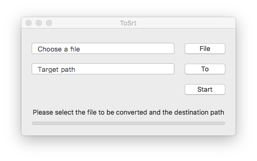

# ToSrt

[README](./README.md) | [中文文档](./README_zh.md)

ToSrt is a tool that can convert subtitles of ASS and SSA to SRT format.  
This process will delete the original subtitles in the special effects.  
ToSrt is based on Swift 3.0 development and last submitted based on MacOS 10.12 system testing.  

## Download

[Release Page](https://github.com/caozhengi/ToSrt/releases)

## File Encoding

ToSrt will automatically check the encoding of the file, currently supports UTF-8 and GBK encoding.  
The format of the converted SRT file is UTF-8.  

## Batch Conversion

ToSrt supports batch conversion, select multiple files need to be converted.  

## The treatment of SRT

If the converted file is originally in SRT format, no conversion will be done except converting the encoding to UTF-8.

## Bug and Requirements

If you find a bug or new requirements can be submitted in the Issues.  
Bug will give priority to repair, the demand will be based on the number of people needed to develop and development of the difficulty.

